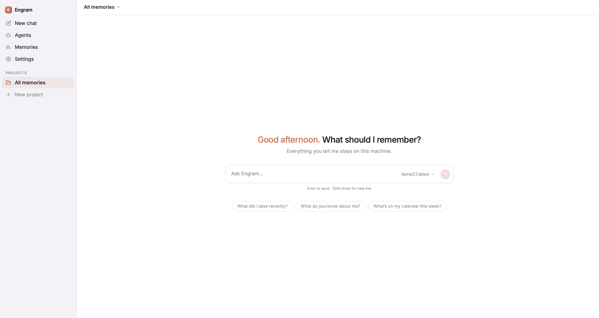
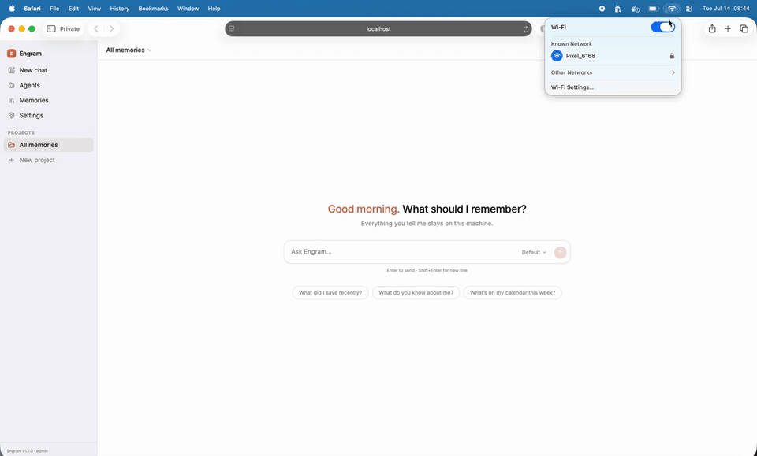
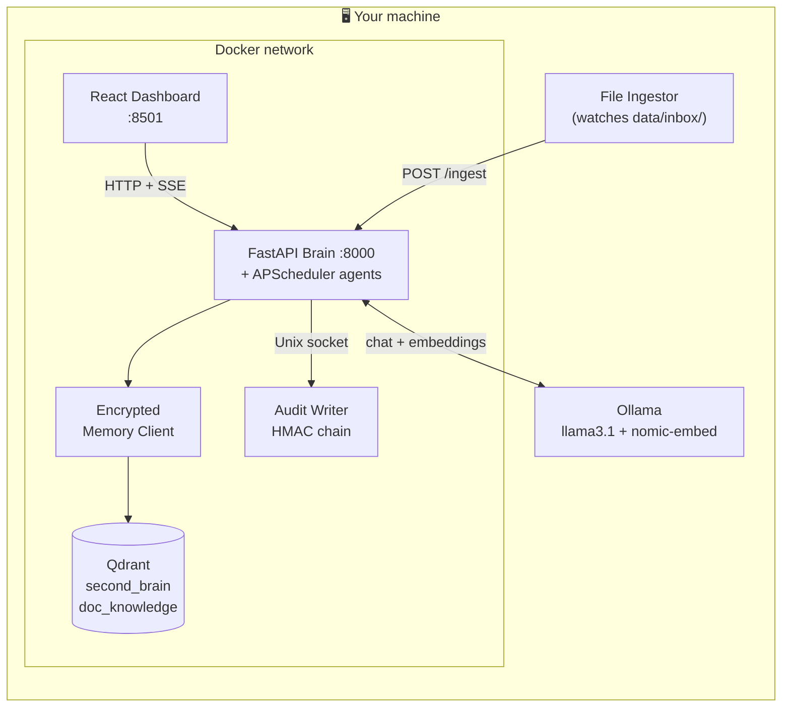
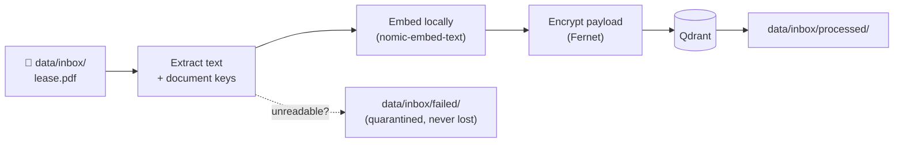
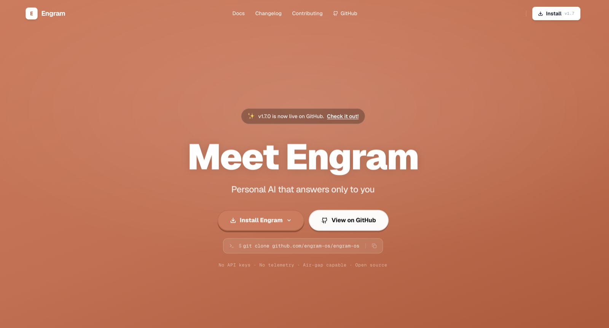

<div align="center">

  

  # Engram OS

  **Your AI. Your machine. Nothing leaves.**

  [](https://www.python.org/)
  [](https://www.docker.com/)
  [](https://ollama.com/)
  []()
  []()
  []()
  [](https://opensource.org/license/mit)
  [](https://github.com/engram-os/engram-os/discussions)

</div>

Engram is a **local-first AI operating system**. It remembers what you tell it, answers questions grounded in those memories, and runs autonomous agents on a schedule — all on your own hardware. No cloud LLM, no telemetry, no call-home mechanism. Unplug the network and everything keeps working.

**How it works in one sentence:** drop files or chat with it → text is embedded and encrypted into a local vector database → when you ask a question, the most relevant memories are retrieved and a local Llama 3.1 answers from them — showing you exactly which memories it used.

<p align="center">
  
</p>

**Here's the whole loop, with Wi-Fi off the entire time** — drop a file, ask about it, get an answer that cites the exact memory it came from:

<p align="center">
  
</p>

---

## How it's different

A lot of AI tools say "local-first." Usually that means your *files* stay local — while transcription, voice, analytics, and the model itself are cloud APIs. Engram means it literally. And because promises are cheap, every claim below comes with the command that checks it:

| Claim | Verify it yourself |
|---|---|
| **The model runs on your machine** | There are no LLM API keys anywhere in this codebase — search it. Inference is your own Ollama: `curl localhost:11434/api/tags` |
| **No hidden network calls** | `grep -rn "import requests" --include="*.py" .` → exactly one file, `core/network_gateway.py`, an allowlisted gateway. CI fails the build if a second ever appears |
| **No telemetry, no analytics** | No PostHog, no Sentry, no tracking pixel. The dependency lists are short — read them: `config/requirements.txt`, `dashboard/package.json` |
| **Memories are encrypted at rest** | `core/memory_client.py` Fernet-encrypts every payload before Qdrant sees a byte. Steal the DB volume, get ciphertext |
| **Agent actions are tamper-evident** | `curl localhost:8000/api/audit/verify` re-computes the HMAC chain over every action ever logged |
| **It works with the network unplugged** | Turn off Wi-Fi. Ask it something. That's the whole test |

If you want an AI coworker that's *stored* locally but *thinks* in someone else's cloud, there are polished options. Engram is for the other case: the one where "private" has to survive an audit, not a marketing page.

---

## Quick Start

**Prerequisites**

- [Docker + Docker Compose](https://docs.docker.com/get-docker/)
- [Python 3.11+](https://www.python.org/)
- [Ollama](https://ollama.com/) running on the host at port `11434`, with both models pulled:

```bash
ollama pull llama3.1:latest
ollama pull nomic-embed-text:latest
```

**Install & run — one command**

Heads up: first run pulls **~5GB of model weights** (Llama 3.1 8B + the embedding model) via Ollama — everything after that is instant and offline.

```bash
curl -fsSL https://raw.githubusercontent.com/engram-os/engram-os/main/scripts/install.sh | bash
```

The installer checks Docker/Python/Ollama, pulls missing models, clones the repo, and starts everything. It's idempotent — safe to re-run. (Prefer to read scripts before piping them to bash? Good instinct — [it's right here](scripts/install.sh).)

<details>
<summary><strong>Or step by step</strong></summary>

```bash
# 1. Clone
git clone https://github.com/engram-os/engram-os.git && cd engram-os

# 2. One-time setup — creates venv, installs dependencies, generates secrets
chmod +x scripts/setup.sh && ./scripts/setup.sh

# 3. Launch everything
./scripts/start.sh
```

</details>

That's it. After startup:

| Service | URL | What it is |
|---|---|---|
| **Dashboard** | `http://localhost:8501` | React chat UI, memory browser, agent feed |
| **API (Brain)** | `http://localhost:8000` | FastAPI orchestrator |
| **Qdrant** (dev only) | `http://localhost:6334/dashboard` | Vector DB explorer |

> Qdrant's port is only exposed in dev via `docker-compose.override.yml` — the default production stack keeps it internal.

---

## Architecture

Everything runs inside one Docker network on your machine, plus Ollama and the file ingestor on the host:



Four design decisions worth knowing:

1. **One process for API + agents.** Scheduled agents run via APScheduler *inside* the FastAPI process — no Celery, no Redis, no worker containers. Less to run, less to break, right-sized for a single-user machine.
2. **Memories are encrypted before they touch the database.** The memory client Fernet-encrypts every payload; only filterable keys (`user_id`, `matter_id`, `type`, `classification`, `status`) stay in plaintext. Someone who steals the Qdrant volume gets ciphertext.
3. **The audit log has one writer.** A dedicated container owns the audit database and accepts writes only over a Unix socket. Every agent action is HMAC-chained to the previous one — tampering breaks the chain, and `GET /api/audit/verify` proves it.
4. **The LLM is a plug.** All inference goes through one small interface, so swapping Llama for any Ollama model is a config change — the dashboard even has a per-message model picker.

---

## Chat with your memory

Ask a question and Engram answers **only from what you've stored** — and tells you which memories it used:

```bash
curl -X POST localhost:8000/chat \
  -H "Content-Type: application/json" \
  -d '{"text": "When does my passport expire?", "stream": false}'
```

```json
{
  "reply": "Your passport expires on 14 March 2027. You also saved a note to start the renewal in January.",
  "context_used": [
    { "memory": "passport_scan.pdf — expiry 2027-03-14 ...", "score": 0.94, "classification": "PII" },
    { "memory": "Note: start passport renewal in January ...", "score": 0.81, "classification": "INTERNAL" }
  ]
}
```

Set `"stream": true` for token-by-token SSE streaming (that's what the dashboard uses). Sensitive memories are auto-classified (PII / PHI / Confidential / …) and sanitized before they reach the model.

Prefer the OpenAI SDK? Engram speaks that too:

```python
from openai import OpenAI

client = OpenAI(base_url="http://localhost:8000/v1", api_key="not-needed-locally")
resp = client.chat.completions.create(
    model="llama3.1:latest",
    messages=[{"role": "user", "content": "What did I save about the kitchen renovation?"}],
)
```

---

## Feed it files

Drop any of these into `data/inbox/` and it becomes searchable memory within ~5 seconds:

```
.pdf  .xlsx  .txt  .md  .csv  .json  .yaml  .yml
.py   .js    .ts   .html  .xml  .rst
```



- **Duplicates** are caught by vector similarity; re-ingesting the same structured document updates it in place.
- Want the ingestor to survive reboots? Install it as a service:

```bash
./scripts/install_ingestor.sh          # macOS (launchd)
./scripts/install_ingestor_systemd.sh  # Linux (systemd user unit)
```

---

## Autonomous agents

Agents are **defined in YAML**, scheduled by APScheduler, and logged to the tamper-evident audit trail. This is the entire definition of the calendar agent:

```yaml
# agents/definitions/calendar.yaml
name: calendar
description: Scans encrypted memories and schedules Google Calendar events
handler: agents.tasks._fan_out_calendar
schedule:
  type: interval
  minutes: 15
enabled: true
```

Add a `.yaml` file, restart the brain, and your agent is live. The ones that ship:

| Agent | Schedule | What it does |
|---|---|---|
| **Calendar Agent** | every 15 min | Finds explicit scheduling intent in new memories ("remind me to…") and creates Google Calendar events |
| **Email Agent** | every 60 min | Reads unread Gmail threads and drafts replies locally — saves to Drafts, **never auto-sends** |
| **Terminal Genie** | on demand | Type `??` after a failed shell command to get a corrected version |
| **Git Automator** | on demand | Semantic commit messages and PR descriptions from your diff, plus secret scanning |
| **DocSpider** | on demand | Crawls documentation sites into a local, offline-searchable knowledge base |

Every agent action lands in the audit chain:

```bash
curl localhost:8000/api/audit/verify
# → { "valid": true, "entries_checked": 1284 }
```

Google Calendar / Gmail need one-time OAuth setup: put your `credentials.json` in `credentials/` and run `python3 scripts/generate_token.py`.

---

## Security model

| Layer | Mechanism |
|---|---|
| **Memory at rest** | Fernet encryption (AES-128-CBC + HMAC) applied *before* payloads reach Qdrant |
| **Key management** | `ENGRAM_ENCRYPTION_KEY` env var, or an auto-generated `~/.engram/vault.key` (chmod 600) |
| **API auth** | `X-API-Key` header. Unset = dev mode (local admin); set it before exposing the port beyond localhost |
| **Classification** | Every memory is auto-classified (PII / PHI / Confidential / Internal / Public) and sanitized above a threshold before reaching the LLM |
| **Audit trail** | HMAC hash chain over every read/write/agent action, held by a single-writer container |
| **Network egress** | All outbound HTTP goes through one gateway module with an allowlist; private IP ranges and cloud metadata endpoints are blocked |

Generate your secrets once:

```bash
echo "ENGRAM_API_KEY=$(openssl rand -hex 32)" >> .env
echo "AUDIT_HMAC_SECRET=$(openssl rand -hex 32)" >> .env
echo "ENGRAM_ENCRYPTION_KEY=$(python3 -c 'from cryptography.fernet import Fernet; print(Fernet.generate_key().decode())')" >> .env
```

---

## API at a glance

| Method | Endpoint | Purpose |
|---|---|---|
| `POST` | `/chat` | Ask a question (set `stream: true` for SSE; final event carries `context_used`) |
| `POST` | `/v1/chat/completions` | OpenAI-compatible chat |
| `POST` | `/add-memory` | Store a memory explicitly |
| `GET` | `/api/memories` | List memories with type / matter / classification filters |
| `DELETE` | `/api/memory/:id` | Delete one memory (ownership-checked) |
| `GET` | `/api/search/unified` | Search personal memories + doc knowledge together |
| `GET` | `/api/models` | List models available on your Ollama |
| `POST` | `/run-agents/calendar` | Trigger an agent right now |
| `GET` | `/api/audit/verify` | Verify the audit hash chain |

There's also an **MCP server** (`api/mcp_server.py`) exposing memory search and ingestion as tools, so MCP-capable clients (like Claude Code) can use your Engram as a memory backend.

---

## Project structure

```
engram-os/
├── core/           # FastAPI brain, encrypted memory client, LLM interface, auth
├── api/            # Route modules: chat, memory, agents, matters, audit, OpenAI compat, MCP
├── agents/         # Agent handlers + YAML definitions (agents/definitions/*.yaml)
├── sensors/        # File ingestor (watches data/inbox/)
├── audit_writer/   # Single-writer audit log container (Unix socket IPC)
├── dashboard/      # React + Vite dashboard (port 8501)
├── frontend/       # engram-os.com marketing site (Next.js)
├── tools/          # DocSpider crawler, memory graph visualizer
├── cli/            # Terminal Genie
├── scripts/        # setup / start / stop / ingestor service installers
├── tests/          # 198 tests
└── docker-compose.yml
```

---

## Configuration

| Variable | Default | Purpose |
|---|---|---|
| `ENGRAM_API_KEY` | *(unset → dev mode)* | API authentication |
| `ENGRAM_ENCRYPTION_KEY` | *(auto-generated)* | Memory encryption — set it explicitly so all containers share one key |
| `AUDIT_HMAC_SECRET` | — | Signs the audit chain |
| `ENGRAM_USER_ID` | *(auto-generated)* | Pins one identity across all containers |
| `OLLAMA_HOST` | `http://host.docker.internal:11434` | Where the models live |
| `QDRANT_HOST` | `qdrant` | Vector DB hostname (Docker service name) |

---

## Development

```bash
# Run the test suite
./venv/bin/python -m pytest tests/ -q        # 198 passing

# API only, with hot reload
uvicorn core.brain:app --port 8000 --reload

# Dashboard only
cd dashboard && npm run dev

# File ingestor on the host
PYTHONPATH=$(pwd) venv/bin/python sensors/ingestor.py
```

Contributions welcome — see [`CONTRIBUTING.md`](CONTRIBUTING.md). Please run the tests and `scripts/lint_imports.sh` before opening a PR.

---

## Community

- 💬 **[GitHub Discussions](https://github.com/engram-os/engram-os/discussions)** — questions, ideas, setups, show & tell
- 🐛 **[Issues](https://github.com/engram-os/engram-os/issues)** — bugs and feature requests
- 🌐 **[engram-os.com](https://engram-os.com)** — docs, guides, changelog

---

## Learn more

Guides, design decisions, the full API reference, and the changelog live at **[engram-os.com](https://engram-os.com)**.

<p align="center">
  <a href="https://engram-os.com">
    
  </a>
</p>

## License

[MIT](LICENSE) — use it, modify it, embed it, ship it. No strings beyond attribution.
